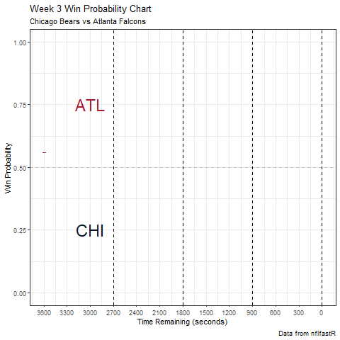

```{r setup, include=FALSE}
knitr::opts_chunk$set(echo = TRUE)
```

```{r}
library(tidyverse)     # for data cleaning and plotting
library(googlesheets4) # for reading googlesheet data
library(lubridate)     # for date manipulation
library(openintro)     # for the abbr2state() function
library(palmerpenguins)# for Palmer penguin data
library(maps)          # for map data
library(ggmap)         # for mapping points on maps
library(gplots)        # for col2hex() function
library(RColorBrewer)  # for color palettes
library(sf)            # for working with spatial data
library(leaflet)       # for highly customizable mapping
library(ggthemes)      # for more themes (including theme_map())
library(plotly)        # for the ggplotly() - basic interactivity
library(gganimate)     # for adding animation layers to ggplots
library(gifski)        # for creating the gif (don't need to load this library every time,but need it installed)
library(transformr)    # for "tweening" (gganimate)
library(shiny)         # for creating interactive apps
gs4_deauth()           # To not have to authorize each time you knit.
library(teamcolors)
if (!requireNamespace("remotes", quietly = TRUE)) {install.packages("remotes")}
remotes::install_github("mrcaseb/nflfastR")
options(scipen = 9999)
theme_set(theme_minimal())

```


```{r}
data <- readRDS(url('https://raw.githubusercontent.com/guga31bb/nflfastR-data/master/data/play_by_play_2020.rds'))
```

```{r}
Week3ATL <- data %>% 
            filter(week == 3) %>%
            filter(home_team == 'ATL')
```

```{r}
nfl_teamcolors <- teamcolors %>% filter(league == "nfl")
atl_color <- nfl_teamcolors %>%
  filter(name == "Atlanta Falcons") %>%
  pull(primary)
chi_color <- nfl_teamcolors %>%
  filter(name == "Chicago Bears") %>%
  pull(primary)
```

```{r, , fig.cap='Win Probability Chart.', tidy=FALSE}
Week3ATL %>% filter(!is.na(home_wp),
         !is.na(away_wp)) %>%
  dplyr::select(game_seconds_remaining,
                home_wp,
                away_wp) %>%
  gather(team, wpa, -game_seconds_remaining) %>%
  ggplot(aes(x = game_seconds_remaining, y = wpa, color = team)) +
  geom_line(size = 2) +
  geom_hline(yintercept = 0.5, color = "gray", linetype = "dashed") +
  scale_color_manual(labels = c("CHI", "ATL"),
                     values = c(chi_color, atl_color),
                     guide = FALSE) +
  scale_x_reverse(breaks = seq(0, 3600, 300)) + 
  annotate("text", x = 3000, y = .75, label = "ATL", color = atl_color, size = 8) + 
  annotate("text", x = 3000, y = .25, label = "CHI", color = chi_color, size = 8) +
  geom_vline(xintercept = 900, linetype = "dashed") + 
  geom_vline(xintercept = 1800, linetype = "dashed") + 
  geom_vline(xintercept = 2700, linetype = "dashed") + 
  geom_vline(xintercept = 0, linetype = "dashed") + 
  labs(
    x = "Time Remaining (seconds)",
    y = "Win Probability",
    title = "Week 3 Win Probability Chart",
    subtitle = "Chicago Bears vs Atlanta Falcons",
    caption = "Data from nflfastR"
  ) + theme_bw() + 
  transition_reveal(-game_seconds_remaining)


```

```{r}
anim_save("winprob1.gif")
```

```{r, echo=FALSE}

```