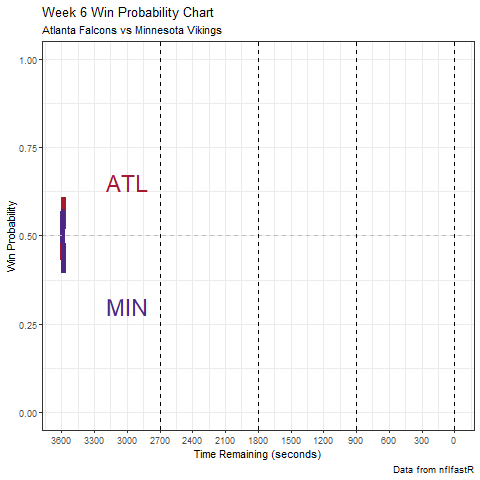

```{r message=FALSE, warning=FALSE}
#library(nflfastR)
library(tidyverse)
library(ggplot2)
library(gganimate)
library(teamcolors)
library(readr)
options(scipen = 9999)
```

```{r message=FALSE, warning=FALSE}
Week6ATL <- read_csv("Week6ATL")
nfl_teamcolors <- teamcolors %>% filter(league == "nfl")
atl_color <- nfl_teamcolors %>%
  filter(name == "Atlanta Falcons") %>%
  pull(primary)
min_color <- nfl_teamcolors %>%
  filter(name == "Minnesota Vikings") %>%
  pull(primary)
```


```{r message=FALSE, warning=FALSE}
Week6ATL %>% filter(!is.na(home_wp),
         !is.na(away_wp)) %>%
  dplyr::select(game_seconds_remaining,
                home_wp,
                away_wp) %>%
  gather(team, wpa, -game_seconds_remaining) %>%
  ggplot(aes(x = game_seconds_remaining, y = wpa, color = team)) +
  geom_line(size = 2) +
  geom_hline(yintercept = 0.5, color = "gray", linetype = "dashed") +
  scale_color_manual(labels = c("ATL", "MIN"),
                     values = c(atl_color, min_color),
                     guide = FALSE) +
  scale_x_reverse(breaks = seq(0, 3600, 300)) + 
  annotate("text", x = 3000, y = .65, label = "ATL", color = atl_color, size = 8) + 
  annotate("text", x = 3000, y = .30, label = "MIN", color = min_color, size = 8) +
  geom_vline(xintercept = 900, linetype = "dashed") + 
  geom_vline(xintercept = 1800, linetype = "dashed") + 
  geom_vline(xintercept = 2700, linetype = "dashed") + 
  geom_vline(xintercept = 0, linetype = "dashed") + 
  labs(
    x = "Time Remaining (seconds)",
    y = "Win Probability",
    title = "Week 6 Win Probability Chart",
    subtitle = "Atlanta Falcons vs Minnesota Vikings",
    caption = "Data from nflfastR"
  ) + theme_bw() + 
  transition_reveal(-game_seconds_remaining)
```


```{r,echo=FALSE}
anim_save("winprob6.gif")
```

```{r, echo=FALSE}

```